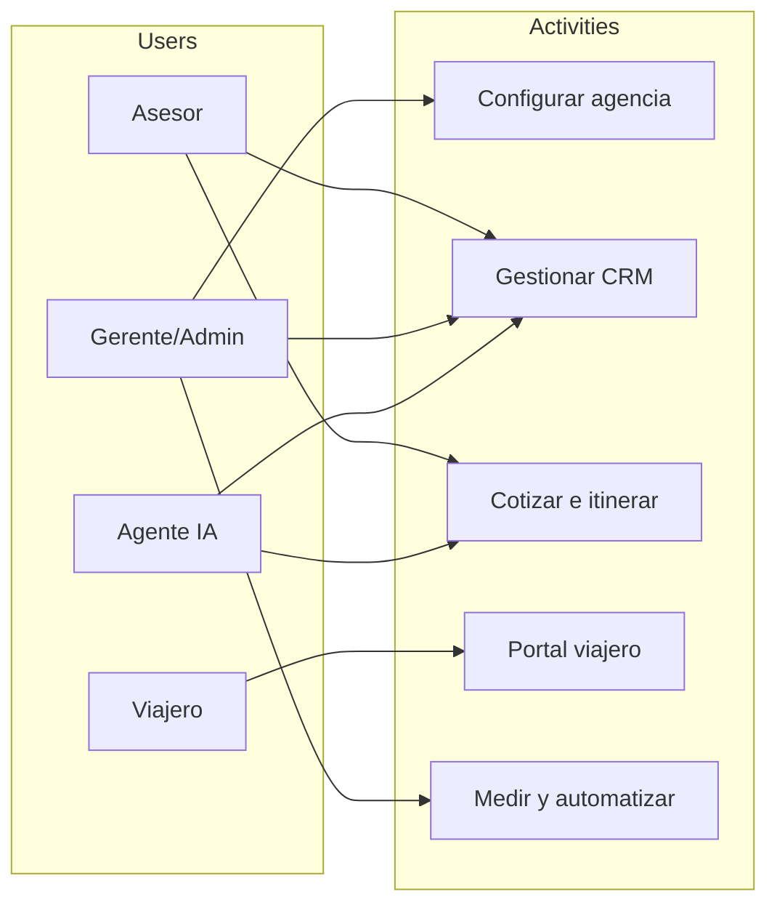

# Momento 3: Decidir — User Story Map (TravelOS AI)

**Goal:** Identify the main system functionalities and the technology that supports them.

**Tool note:** This map can be mirrored in [Miro](https://miro.com/) for a sticky-note workshop board.

**Releases ↔ delivery plan**

| Release | Scope | Sprint / Milestone |
|---|---|---|
| **Release 1** | Foundation + Smart CRM core | Sprint 1 |
| **Release 2** | AI quoter + itineraries + agency knowledge | Sprint 2 |
| **Release 3** | Traveler portal + insights + follow-up automation | Sprint 3 |

**Primary technology (MVP)**  
Next.js 15 · NestJS · PostgreSQL/Prisma · Redis/BullMQ · Zod · Auth/JWT · Tailwind · OpenAI (from Release 2) · Object storage for docs/PDFs

---

## Backbone (users → activities → tasks)

### Users

| Sticky (USER) | Who |
|---|---|
| **Asesor** | Travel advisor selling day to day |
| **Gerente / Admin** | Agency owner or operations admin |
| **Viajero** | End customer after booking |
| **Agente IA** | Digital sales/ops agent (system actor) |

### Activities & tasks

| USER | USER ACTIVITY | USER TASKS |
|---|---|---|
| Gerente / Admin | **Configurar la agencia (tenancy)** | Registrar agencia · Iniciar sesión segura · Asignar roles RBAC · Configurar marca blanca (logo/color) |
| Asesor / Gerente | **Gestionar prospectos (CRM)** | Crear/editar leads · Mover etapas del pipeline · Filtrar y listar clientes · Asignar lead a asesor · Crear tareas/recordatorios |
| Asesor + Agente IA | **Priorizar y atender leads** | Ver recomendaciones del copiloto IA · Contactar leads de alta probabilidad · Escalar de IA a humano |
| Asesor | **Cotizar viajes con IA** | Escribir pedido en lenguaje natural · Revisar opciones comparables · Exportar cotización PDF · Vincular cotización al lead |
| Asesor | **Construir itinerarios** | Armar itinerario día a día · Agregar actividades del catálogo · Previsualizar / exportar itinerario |
| Gerente / Admin | **Entrenar la IA de la agencia** | Cargar políticas/FAQs/tono · Actualizar base de conocimiento · Desplegar cambios de conocimiento |
| Viajero | **Seguir su viaje (portal)** | Ver itinerario · Consultar documentos · Chatear con la agencia · Revisar estado del viaje |
| Gerente | **Medir el negocio** | Ver KPIs de ventas/conversión · Analizar destinos y asesores · Recibir alertas de seguimiento |
| Sistema | **Automatizar seguimiento** | Detectar leads fríos · Enviar recordatorios de follow-up · Registrar auditoría de acciones sensibles |

---

## User Story Map (stories by release)

Stories are phrased for mapping; GitHub Issues are the execution backlog ([issues](https://github.com/Jeronimo0228/travel-OS/issues)).

### Activity: Configurar la agencia

| Release 1 | Release 2 | Release 3 |
|---|---|---|
| As an **admin**, I want to **register my agency (tenant)** so we operate in an isolated space. (#1) | As an **admin**, I want to **upload agency knowledge (policies/tone)** so the AI answers like us. (#24) | — |
| As a **user**, I want to **log in securely** so I only access my modules. (#2) | | |
| As an **admin**, I want to **assign RBAC roles** so permissions match the job. (#3) | | |
| As a **manager**, I want **basic white-label branding** so the app shows our identity. (#4) | | |
| As **DevSecOps**, I want **audit logs + health/CI** so the platform is operable and traceable. (#5, #6) | | |

### Activity: Gestionar prospectos (CRM)

| Release 1 | Release 2 | Release 3 |
|---|---|---|
| As an **advisor**, I want to **create/edit leads** so prospects are centralized. (#7) | As an **advisor**, I want an **AI prioritization copiloto** so I contact the best leads first. (#10) | As a **manager**, I want **follow-up reminders automated** so cold leads are not lost. (#23) |
| As an **advisor**, I want a **visual pipeline by stages** so I see sales status. (#8) | | |
| As an **advisor**, I want **tasks/reminders on a lead** so I do not miss follow-ups. (#9) | | |
| As an **advisor**, I want to **filter leads** by stage/advisor/destination. (#11) | | |
| As a **manager**, I want to **assign leads to advisors** so workload is distributed. (#12) | | |

### Activity: Cotizar e itinerar

| Release 1 | Release 2 | Release 3 |
|---|---|---|
| — (UI shell only from prototype reuse) | As an **advisor**, I want to **quote in natural language** so options are generated by AI. (#13) | — |
| | As an **advisor**, I want to **compare quote options** before sending. (#14) | |
| | As an **advisor**, I want to **export a quote PDF**. (#15) | |
| | As an **advisor**, I want to **build a day-by-day itinerary**. (#16) | |
| | As an **advisor**, I want to **link quotes to a lead**. (#17) | |
| | As the **system**, I want a **seed hotel/activity catalog** so we can quote without live GDS. (#18) | |

### Activity: Acompañar al viajero (portal)

| Release 1 | Release 2 | Release 3 |
|---|---|---|
| — | — | As a **traveler**, I want to **see my trip itinerary** on my phone. (#19) |
| | | As a **traveler**, I want to **see trip documents**. (#20) |
| | | As a **traveler**, I want to **chat with the agency**. (#21) |

### Activity: Medir y mejorar

| Release 1 | Release 2 | Release 3 |
|---|---|---|
| — | — | As a **manager**, I want a **KPI dashboard** (sales, conversion, advisors, destinations). (#22) |

---

## Release slices (sticky-note view)

### Release 1 — Must have to start selling process digitally
- Register agency / login / RBAC / branding  
- Leads CRUD + pipeline + tasks + filters + assignment  
- Audit + health + CI  
- **Tech focus:** Auth, multi-tenant Postgres model, NestJS modules, Next.js shell reused from prototype (`index.html`, `crm.html`)

### Release 2 — Must have to quote faster than competitors
- NL quoter + options + PDF + link to lead  
- Itinerary builder + seed catalog  
- AI copiloto prioritization + agency knowledge base  
- **Tech focus:** OpenAI orchestration, BullMQ workers, RAG/knowledge per `agencyId`, reuse `cotizador.html` / `itinerario.html`

### Release 3 — Must have for pilot & traveler experience
- Traveler portal (itinerary, docs, chat)  
- Manager KPI dashboard  
- Follow-up automation  
- **Tech focus:** traveler tokens, portal routes, metrics aggregations, automation jobs

---

## Mermaid backbone (for docs / Miro import aid)

---

## How this maps to coding plans

| Role | Release 1 plan |
|---|---|
| Backend | `documentation/plans/sprint-1/backend.md` |
| Frontend | `documentation/plans/sprint-1/frontend.md` |
| DevSecOps | `documentation/plans/sprint-1/devsecops.md` |
| QA | `documentation/plans/sprint-1/qa.md` |
| UX | `documentation/plans/sprint-1/ux.md` |

Prototype reuse guide: [`documentation/plans/MOCKUP-CODE-SOURCE.md`](../plans/MOCKUP-CODE-SOURCE.md)
