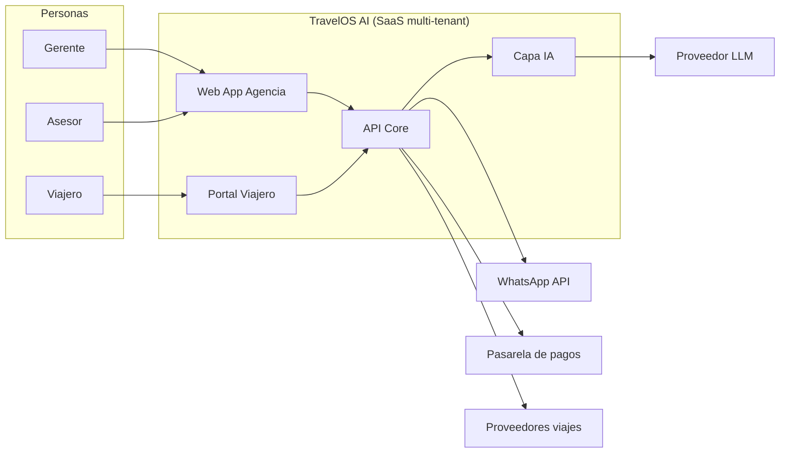
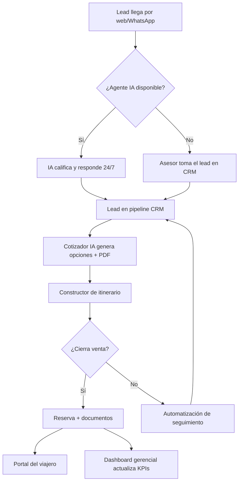

# Definición del Producto — TravelOS AI

## Sección 1. Generalidades del Proyecto

### 1.1 Descripción del problema y su solución software

**Problema.** Las agencias de viajes en Latinoamérica operan con herramientas fragmentadas (WhatsApp, Excel, Drive, PDFs, correos y sistemas de reserva desconectados). Eso genera:

1. Pérdida de clientes por respuestas tardías (el viajero cotiza con 5 agencias a la vez).
2. Cotizaciones lentas y 100% manuales.
3. Información dispersa y dependencia del asesor (fuga de conocimiento al renunciar).
4. Ausencia de seguimiento y de métricas de conversión/rentabilidad.
5. Viajeros que exigen autoservicio inmediato desde el celular.

**Cifras de contexto (para sustentación — fuentes a citar en pitch):**

- El canal digital y mensajería instantánea concentran la primera interacción comercial de turismo en LATAM; demoras de horas reducen drásticamente la probabilidad de cierre.
- Agencias SMB reportan alta carga operativa en armar cotizaciones/itinerarios (múltiples sistemas por una sola propuesta).
- El costo de adquirir un lead se pierde sin nurturing automatizado.

**Solución.** **TravelOS AI** es una plataforma SaaS multi-tenant con IA que actúa como *sistema operativo* de la agencia: CRM inteligente, agente de ventas omnicanal, cotizador e itinerarios con IA, portal del viajero, automatizaciones, inteligencia gerencial y gestión documental/financiera — con marca blanca y aprendizaje del tono/políticas de cada agencia.

No es “un CRM”, “un chatbot” o “un cotizador”: es el **centro de operaciones** completo.

### 1.2 Personas y roles del proyecto

| # | Integrante | Usuario | Correo institucional | Foto | Rol |
|---|---|---|---|---|---|
| 1 | Jerónimo Restrepo Ángel | jrestrepoa | jrestrepoa@eafit.edu.co | `assets/team/jeronimo.jpg` *(pendiente cargar)* | **Scrum Master + DevSecOps** |
| 2 | Santiago Arboleda Giraldo | sarboledag | sarboledag@eafit.edu.co | `assets/team/santiago.jpg` *(pendiente)* | **Frontend Developer** |
| 3 | Samuel Madrid Ossa | smadrido | smadrido@eafit.edu.co | `assets/team/samuel.jpg` *(pendiente)* | **Backend Developer** |
| 4 | Miguel Mercado Mercado | mamercado | mamercado@eafit.edu.co | `assets/team/miguel.jpg` *(pendiente)* | **QA Engineer** |
| 5 | Juan José Palacio Zuluaga | jjpalacioz | jjpalacioz@eafit.edu.co | `assets/team/juanjose.jpg` *(pendiente)* | **UX/UI Designer** |

**Product Owner (cliente):** Juan Manuel Restrepo Molina — CEO, Punto D' Partida — juanmcoach@gmail.com — +57 305 233 9865.

### 1.3 Público objetivo y contexto

#### Actores humanos

| Actor | Descripción |
|---|---|
| Dueño / Gerente de agencia | Compra la licencia, ve rentabilidad, conversiones y desempeño de asesores. |
| Asesor de viajes | Usa CRM, cotizador e itinerarios día a día; atiende leads. |
| Agente IA de ventas | Persona digital 24/7 (WhatsApp/web) que califica, cotiza y agenda. |
| Viajero / cliente final | Usa el portal para ver viaje, docs, pagos y chat. |
| Admin / operaciones | Gestiona documentos, automatizaciones y configuración de marca blanca. |
| Contador / finanzas (fase 2) | Comisiones, abonos, estados de cuenta. |

#### Sistemas externos (contexto)

WhatsApp Cloud API, Email (SMTP/ESP), pasarelas de pago, GDS/APIs de hoteles-vuelos (fase piloto: catálogo curado / providers mock), almacenamiento de objetos, proveedor LLM, Google Business (fase 2).

#### Diagrama de contexto

### 1.4 Descripción del proceso de interacción

| Usuario | Flujo principal |
|---|---|
| Asesor | Login → CRM (priorización IA) → Cotizar en lenguaje natural → Ajustar itinerario → Enviar propuesta → Seguimiento. |
| Gerente | Login → Dashboard → Embudos/asesores/destinos → Alertas IA → Campañas. |
| Viajero | Magic link/app → Ver itinerario, docs, pagos, chat, alertas. |
| Agente IA | Recibe mensaje → Consulta políticas de la agencia → Responde/cotiza/agenda → Escalamiento a humano. |

### 1.5 Glosario de términos

| Término | Definición |
|---|---|
| TravelOS AI | Plataforma SaaS objeto de este proyecto. |
| Multi-tenant | Una instancia lógica por agencia (datos, marca e IA aislados). |
| Lead / Prospecto | Persona interesada aún no convertida en reserva. |
| Pipeline / Embudo | Etapas comerciales (prospecto → cotizando → cierre → ganado). |
| Cotización | Propuesta de viaje con precios, hoteles, vuelos e itinerario. |
| Itinerario | Secuencia día a día de actividades/servicios del viaje. |
| Portal del viajero | App/web del cliente final post-venta. |
| Marca blanca | Personalización de logo, dominio, colores e IA por agencia. |
| Agente IA | Microservicio conversacional especializado (ventas, cobranza, etc.). |
| MVP | Producto mínimo estable para piloto con agencias reales. |
| PO | Product Owner (cliente): Juan Manuel Restrepo Molina. |
| Historia de usuario (HU) | Requisito ágil en formato “Como… quiero… para…”. |
| Épica | Conjunto grande de HUs relacionadas. |
| Sprint | Iteración time-boxed de entrega. |

---

## Sección 2. Determinación de necesidades

### 2.1 Requisitos funcionales (proceso de elicitación)

**Técnicas usadas**

1. Entrevista semi-estructurada con el Product Owner (Kickoff).
2. Análisis de documento de visión del producto (TravelOS AI).
3. Revisión de prototipo UI existente (TravelOS-AI-Ecosystem).
4. Benchmarking competitivo (ver 2.2).
5. Story Mapping colaborativo (Planning interno).

**Participantes:** equipo completo Grupo 2 + Juan Manuel Restrepo Molina (PO).  
**Cuándo:** Kickoff 22-jul-2026; Planning 24-jul-2026.  
**Evidencias:** ver [Ceremonias](./08-Ceremonias.md) y `docs/elicitation/`.

**RF principales (MVP)**

| ID | Requisito |
|---|---|
| RF-01 | Registro/login de usuarios de agencia con roles (gerente, asesor, admin). |
| RF-02 | Gestión multi-tenant de agencia (marca, datos aislados). |
| RF-03 | CRM: crear/editar leads, stages de pipeline, tareas y recordatorios. |
| RF-04 | Copiloto IA que prioriza leads a contactar. |
| RF-05 | Cotizador por lenguaje natural → opciones + PDF. |
| RF-06 | Constructor de itinerarios (días, actividades, export PDF). |
| RF-07 | Portal del viajero con itinerario, documentos y estado del viaje. |
| RF-08 | Dashboard gerencial (ventas, conversión, destinos, asesores). |
| RF-09 | Automatizaciones básicas (recordatorio de follow-up, felicitación). |
| RF-10 | Gestión documental mínima (subir/asociar pasaporte/contrato a reserva). |
| RF-11 | Auditoría básica de acciones sensibles. |
| RF-12 | Configuración de tono/políticas de la IA por agencia (base de conocimiento). |

### 2.2 Análisis de la competencia

| Aplicación | Empresa | Costo aprox. | Diferencial de TravelOS AI |
|---|---|---|---|
| **TravelJoy** | TravelJoy, Inc. | Planes desde ~US$30–80/mes por agente (según plan público) | TravelOS integra cotizador IA + portal viajero + telefonía/WhatsApp y aprendizaje por agencia; enfoque LATAM/WhatsApp-first. |
| **Travefy** | Travefy | Suscripción por advisor (planes premium) | Travefy destaca en itinerarios; TravelOS añade CRM+IA de ventas+métricas+automatización en un solo SO. |
| **oii.ai / agentes turismo** | Varios vendors IA | Variable / custom | Suelen ser chatbots puntuales; TravelOS es ecosistema operativo completo con marca blanca y dominio propio. |

> Nota: costos de mercado fluctúan; en sustentación citar capturas actualizadas de pricing público.

---

## Sección 3. User Story Mapping y Backlog

Ver detalle completo en [04 — Story Mapping y Backlog](./04-Story-Mapping-y-Backlog.md), [`backlog/product-backlog.md`](../backlog/product-backlog.md) y [`backlog/sprint-1-planning.md`](../backlog/sprint-1-planning.md).
