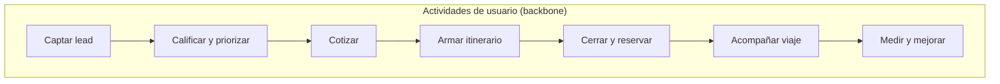

# Story Mapping y Backlog del Producto

## Story Mapping

**Herramienta recomendada para tablero visual:** Miro / FigJam (exportar PNG a `docs/elicitation/story-map.png`).  
A continuación el mapa lógico del MVP:

| Actividad | Release MVP (historias) | Luego |
|---|---|---|
| Captar lead | Form web, alta manual, inbox unificado básico | WhatsApp/Instagram nativo |
| Calificar | Pipeline + score IA | Agente voz |
| Cotizar | NL → opciones + PDF | Conectores GDS reales |
| Itinerario | Editor por días + PDF | Drag&drop mapas avanzados |
| Cerrar | Estado ganado + docs | Pagos/cuotas completas |
| Acompañar | Portal: itinerario, docs, chat | Clima, traductor, QR boarding |
| Medir | Dashboard KPIs | Predicciones avanzadas |

## Épicas (≥3)

| Épica | Objetivo |
|---|---|
| E1 — Fundación multi-tenant | Auth, roles, tenancy, auditoría base |
| E2 — CRM Inteligente | Leads, pipeline, tareas, priorización IA |
| E3 — Cotizador e Itinerarios IA | Cotización NL, PDF, itinerario |
| E4 — Portal Viajero + Insights | Portal mínimo + dashboard gerencial |

## Backlog

- Product Backlog completo (≥20 HU): [`backlog/product-backlog.md`](../backlog/product-backlog.md)
- Issues GitHub: etiquetas `epic:e1..e4`, `sprint:0|1|2|3`
- Sprint 1 detallado: [`backlog/sprint-1-planning.md`](../backlog/sprint-1-planning.md)

**Link de backlog en plataforma:** https://github.com/Jeronimo0228/travel-OS/issues
