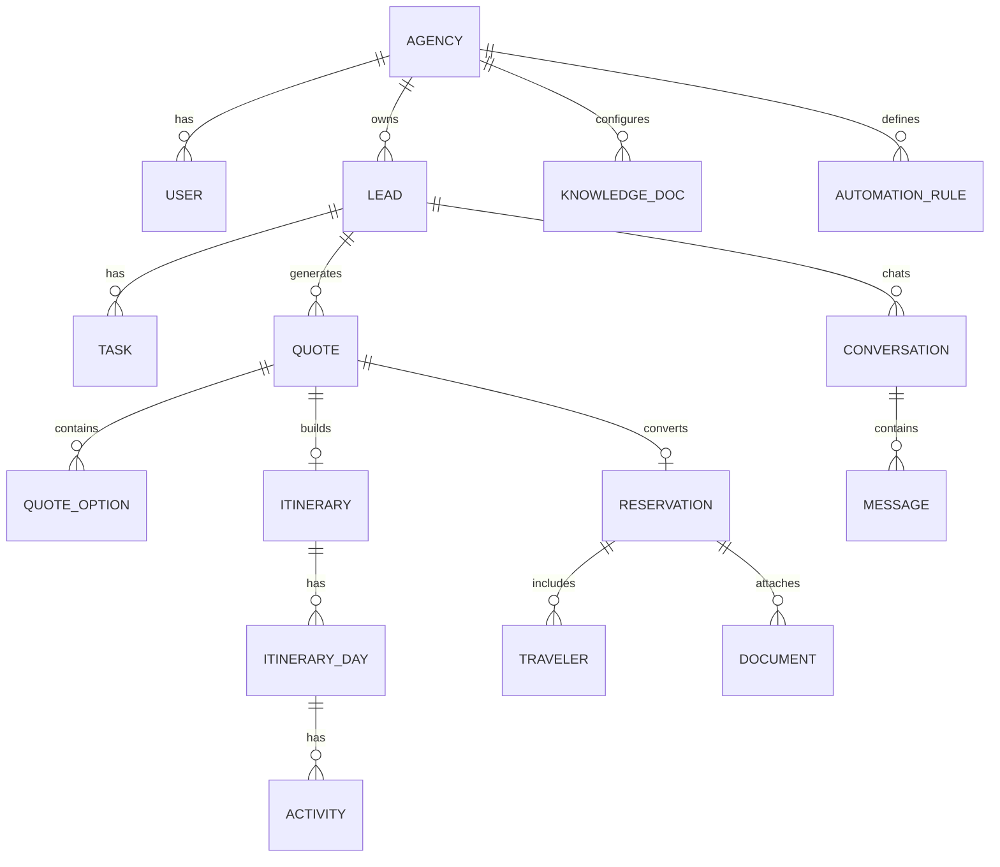
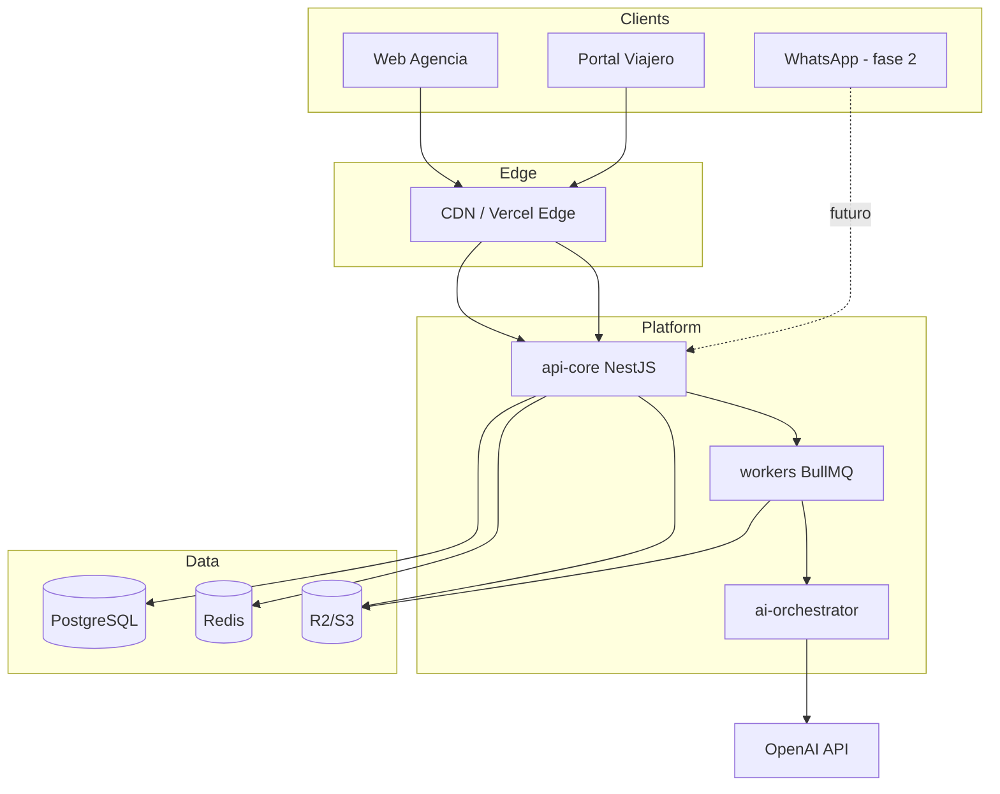

# Diseño de la Arquitectura — TravelOS AI

## 1. Alcance del MVP vs solución completa

| Incluido en MVP (piloto) | Fuera de MVP (roadmap) |
|---|---|
| Multi-tenant + auth + roles | Telefonía IA / voz |
| CRM (leads, pipeline, tareas) | TikTok/FB/IG connectors nativos |
| Copiloto de priorización IA | Agentes jurídicos/contables avanzados |
| Cotizador NL + PDF (catálogo/mock providers) | GDS/amadeus/expedia producción |
| Itinerario por días + export | Mapas drag&drop avanzados |
| Portal viajero (itinerario, docs, chat básico, estado) | Clima, traductor, conversor, QR boarding |
| Dashboard KPIs | Remarketing sofisticado |
| Automatizaciones simples | Motor financiero completo de comisiones |
| Base de conocimiento por agencia (tono/políticas) | Fine-tuning dedicado por tenant |
| Gestión documental mínima | Firmas electrónicas avanzadas |

**Definición de éxito del MVP:** una agencia piloto puede captar leads, cotizar con IA, armar itinerario, compartir portal al viajero y ver métricas básicas — con estabilidad suficiente para demos comerciales.

## 2. Dimensiones del sistema y requisitos no funcionales

### Dimensiones objetivo (piloto)

| Dimensión | Meta MVP |
|---|---|
| Agencias tenant | 1–5 en piloto; diseño hasta 100 |
| Usuarios por agencia | 5–40 (asesores + admin) |
| Viajeros concurrentes | 100–500 en pico de piloto |
| Leads/mes por agencia | hasta ~2.000 |
| Latencia API p95 | < 400 ms (sin LLM) |
| Latencia cotización IA | < 15 s percibidos (async + streaming) |
| Disponibilidad | 99.5% mensual MVP |
| RPS API sostenido | ~50 rps piloto; burst 200 |

### RNF prioritarios

| ID | Categoría | Requisito |
|---|---|---|
| RNF-01 | Seguridad | Aislamiento estricto multi-tenant; secretos solo en env; sin credenciales en git |
| RNF-02 | Seguridad | Auth con sesiones/JWT, RBAC, HTTPS, rate limiting |
| RNF-03 | Privacidad | Datos personales (pasaportes) cifrados en reposo; acceso auditado |
| RNF-04 | Usabilidad | UI responsive; flujos críticos ≤ 3 clics desde home |
| RNF-05 | Accesibilidad | WCAG 2.1 AA en pantallas core (contraste, labels) |
| RNF-06 | Confiabilidad | Jobs async con reintentos; colas para PDF/IA |
| RNF-07 | Observabilidad | Logs estructurados + Sentry + métricas HTTP |
| RNF-08 | Mantenibilidad | Monorepo o repos claros; OpenAPI; tests CI |
| RNF-09 | Escalabilidad | Stateless API + Postgres + Redis horizontal |
| RNF-10 | Portabilidad marca blanca | Theming por tenant (logo, colores, dominio) |

## 3. Modelado del dominio

### Entidades principales

Agency, User, Role, Lead, PipelineStage, Task, Quote, QuoteOption, Itinerary, ItineraryDay, Activity, Reservation, Traveler, Document, KnowledgeDoc, AutomationRule, Conversation, Message, MetricSnapshot.

### Diagrama entidad-relación (simplificado)

## 4. Descripción de componentes y tecnologías

| Componente | Responsabilidad | Tecnología |
|---|---|---|
| `web-agency` | App asesores/gerente | Next.js 15, React 19, TS, Tailwind, shadcn/ui |
| `web-portal` | Portal del viajero | Next.js (app router) mismo monorepo |
| `api-core` | REST/OpenAPI, RBAC, tenancy | NestJS + Prisma |
| `worker` | PDF, IA, automatizaciones | NestJS worker + BullMQ |
| `ai-orchestrator` | Prompts, RAG por agencia, herramientas | Python FastAPI *o* módulo Nest + OpenAI SDK |
| `db` | Persistencia | PostgreSQL 16 |
| `cache-queue` | Sesiones/cache/colas | Redis 7 |
| `object-storage` | Docs y PDFs | Cloudflare R2 / S3 |
| `idp` | Auth | Auth.js + provider email/Google |
| `observability` | Errores/métricas | Sentry + OTEL |
| `ci` | Quality gates | GitHub Actions |

> El prototipo actual (`TravelOS-AI-Ecosystem`, Vite + HTML) se reutiliza como referencia visual y base de componentes UI al migrar a Next.js.

## 5. Diagrama de componentes del sistema

### Justificación

- **Separación web/API/workers:** cumple RNF de latencia (UI rápida) y permite jobs largos de IA/PDF sin bloquear requests.
- **Postgres + Prisma:** dominio relacional rico (CRM, reservas, docs) con migraciones auditable.
- **Redis/BullMQ:** resiliencia para cotizaciones y automatizaciones.
- **RAG por tenant:** diferencial de “IA que aprende la agencia” sin mezclar datos entre clientes.
- **Next.js + NestJS en TypeScript:** velocidad del equipo, tipado end-to-end, reutilización del diseño Tailwind del prototipo.
- **Multi-tenant desde día 1:** requisito de marca blanca y piloto multi-agencia.
